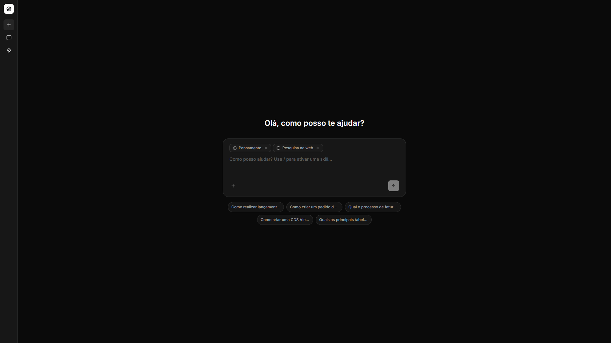

# AI Chat Assistente

> Assistente AI inteligente alimentado por RAG híbrido + LLM via LangGraph.

<br/>



<br/>

## 🚀 Quick Start — Docker (Recomendado)

### 1. Configurar Ambiente

```bash
# Copiar arquivo de exemplo
cp .env.example .env

# Editar .env e configurar sua API key
# LLM_API_KEY=sk-your-openai-api-key
nano .env
```

### 2. Executar com Docker

```bash
docker compose up -d

# acesse em: http://localhost:3000
```