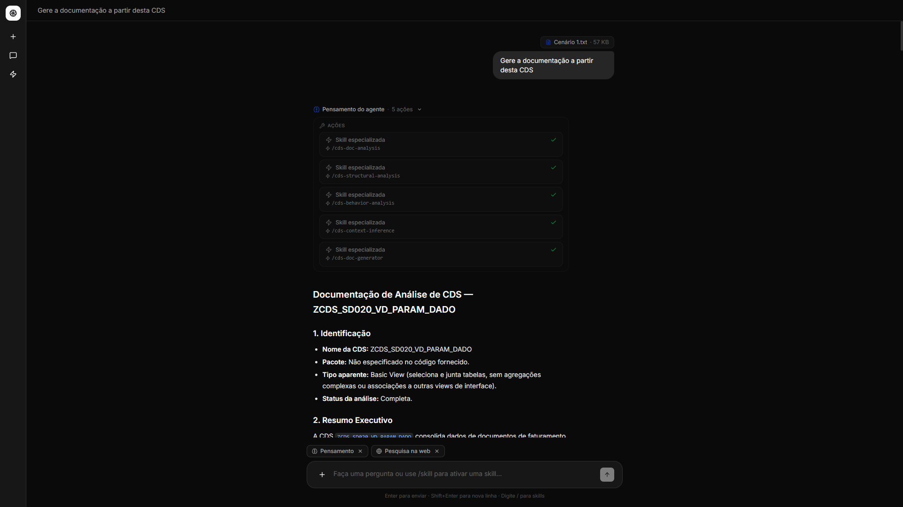
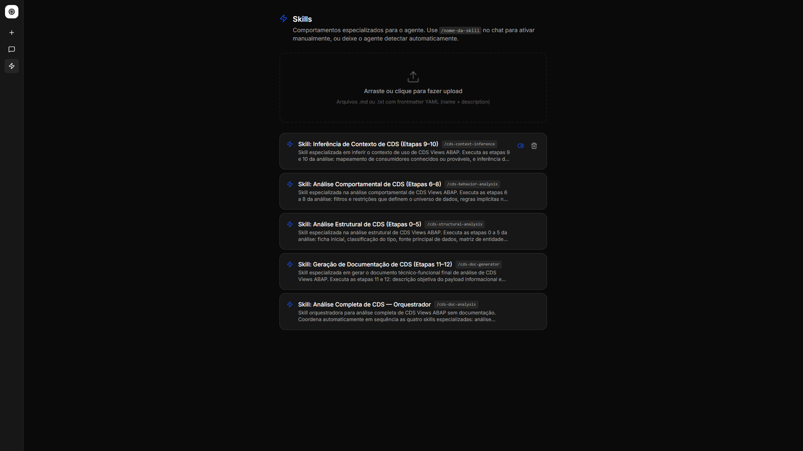
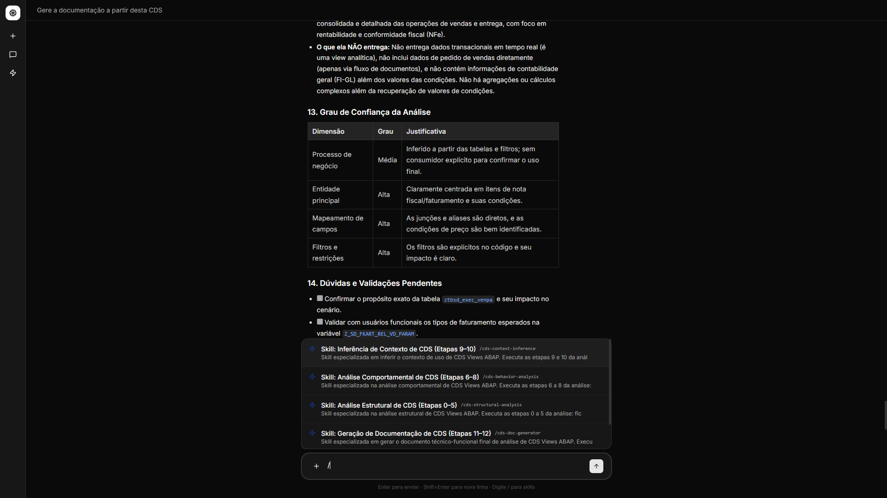

# AI Chat Platform

> A full-stack AI chat application powered by multi-agent reasoning, hybrid RAG, and a streaming interface.

<br/>


<br/>

## About

AI chat platform that combines a **LangGraph ReAct agent** with a **hybrid retrieval-augmented generation (RAG)** pipeline built from scratch. Users interact with the assistant through a clean streaming chat interface, while the agent autonomously decides which tools to invoke — searching the knowledge base, browsing the web, scraping URLs, or applying domain-specific skills.

The knowledge base is built by ingesting PDF documents, which are parsed, chunked, embedded, and stored in PostgreSQL with `pgvector`. At query time, three parallel retrieval strategies (vector similarity, full-text search, and trigram matching) are fused via Reciprocal Rank Fusion to surface the most relevant context.

The **skills system** extends the agent with structured, reusable behavioral templates. Skills are plain Markdown files that guide the agent through multi-step workflows — from detailed analysis protocols to document generation — without requiring code changes.

---

## Features

- **Streaming chat UI** — token-by-token streaming over SSE with tool activity indicators and thinking panels
- **Multi-agent reasoning** — LangGraph ReAct agent with persistent session memory via PostgreSQL checkpointer
- **Hybrid RAG pipeline** — vector search (pgvector), full-text search, and trigram search fused with Reciprocal Rank Fusion; built from scratch, no LangChain retriever wrappers
- **PDF knowledge base** — upload PDFs through the UI; the pipeline parses, chunks, embeds, and indexes them automatically
- **Web search & URL scraping** — agent tools for real-time web research and content extraction from arbitrary URLs
- **Skills system** — Markdown-based behavioral templates with lazy loading; supports multi-phase chain workflows triggered from the UI
- **Session history** — full conversation persistence per session with file attachment support
- **LLM-agnostic** — any OpenAI-compatible API works out of the box (OpenAI, Anthropic via LiteLLM, local models)

<br/>

<table>
  <tr>
    <td></td>
    <td></td>
  </tr>
</table>

---

## Tech Stack

| Layer | Technologies |
|---|---|
| **Backend** | Python 3.13, FastAPI, LangGraph, PostgreSQL + pgvector, SQLAlchemy async, PDM |
| **Frontend** | React 19, TypeScript, Tailwind CSS v4, Vite, shadcn/ui |
| **Infra** | Docker Compose (PostgreSQL 16 with pgvector), SSE streaming |
| **AI** | LangGraph ReAct agent, paraphrase-MiniLM-L6-v2 embeddings (384d), any OpenAI-compatible LLM |

---

## Getting Started

### Prerequisites

- Python 3.13+, [PDM](https://pdm-project.org/)
- Node.js 20+, [pnpm](https://pnpm.io/)
- Docker & Docker Compose

### 1. Environment

Copy `.env.example` to `.env` and fill in your credentials:

```env
DATABASE_URL=
LLM_MODEL=
LLM_API_KEY=sk-...
```

### 2. Backend

```bash
# Start PostgreSQL (creates schema automatically)
docker compose up -d

# Install dependencies
pdm install

# Start the API server on http://localhost:8000
pdm run dev

# API docs -> http://localhost:8000/docs 
```

### 3. Frontend

```bash
cd web

pnpm install

# Start the dev server on http://localhost:5173
pnpm dev
```

---

## License

MIT
